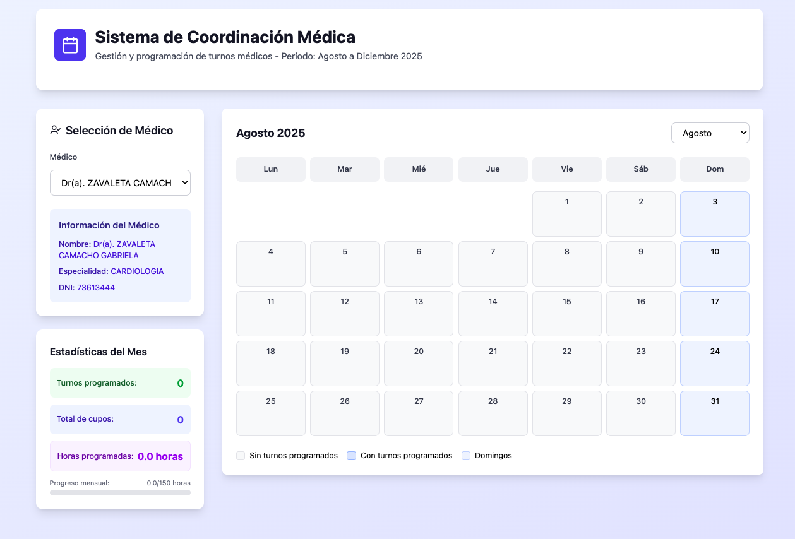
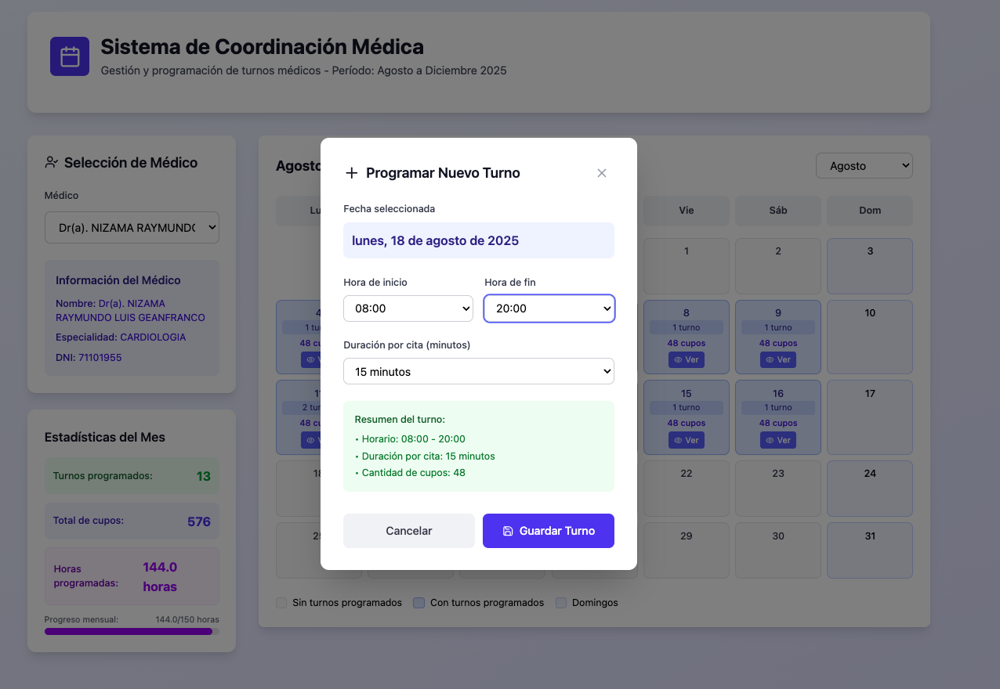
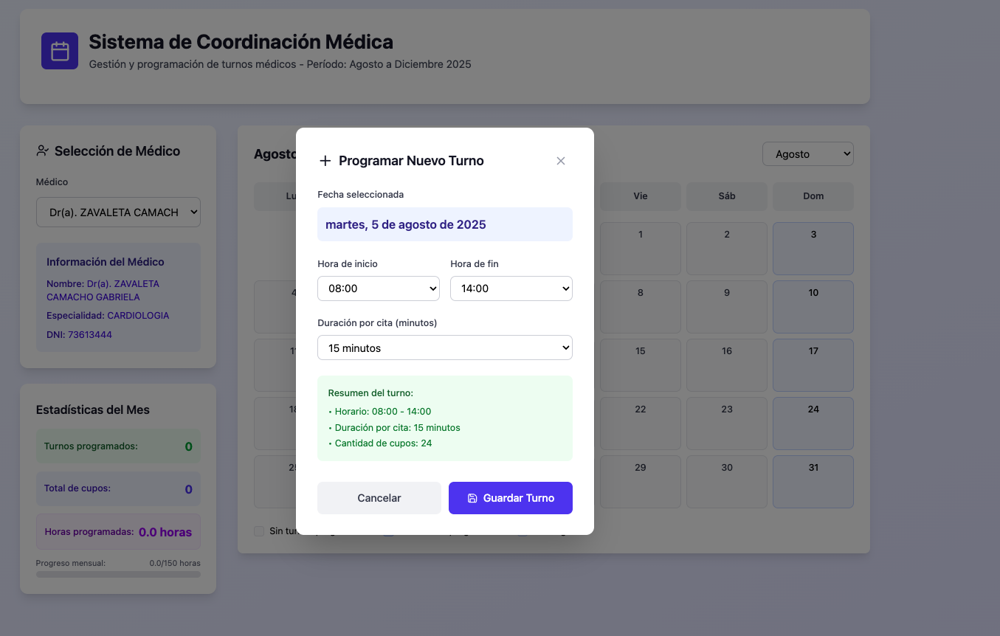
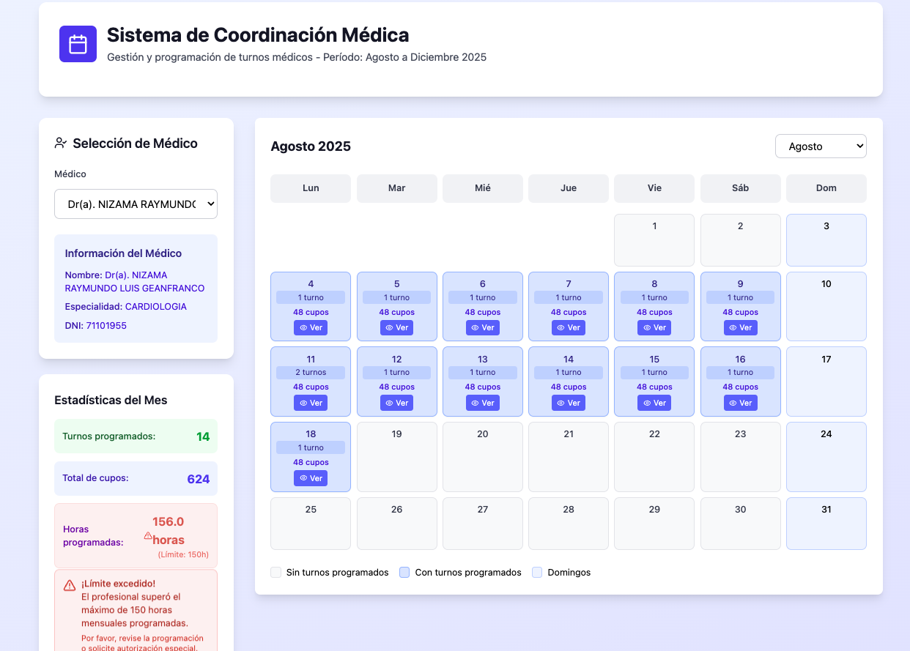

# 🗓️ Sistema de Citas Médicas

# 🏥 Sistema de Coordinación Médica - Gestión de Turnos Hospitalarios

## 📌 Descripción del Proyecto

Este sistema es una **aplicación web especializada** para la gestión y coordinación de turnos médicos en entornos hospitalarios. Permite a los coordinadores médicos:

- Programar turnos para diferentes especialistas
- Visualizar la disponibilidad en calendario interactivo
- Controlar la carga horaria de cada profesional
- Generar reportes estadísticos mensuales

## 🎯 Objetivos Principales

✔ **Optimizar la asignación** de turnos médicos  
✔ **Prevenir sobrecarga laboral** con límites de horas  
✔ **Digitalizar procesos** manuales de coordinación  
✔ **Reducir errores** en asignación de horarios  
✔ **Generar datos precisos** para análisis estadístico  

## 🧑‍💻 Funcionalidades Clave

### 📅 Gestión de Calendario
- Vista mensual interactiva (Agosto-Diciembre 2025)
- Resaltado visual de días con turnos asignados
- Selección por especialidad médica
- Filtrado por médico individual

### ⏱ Control de Turnos
- Creación de bloques horarios configurables:
  - Duración personalizable (15, 30, 45, 60 mins)
  - Horario laboral (6:00 AM - 10:00 PM)
- Asignación de múltiples turnos por día
- Visualización de cupos disponibles por turno

### 👨‍⚕️ Gestión de Profesionales
- Base de datos de médicos por especialidad
- Información detallada por profesional:
  - Nombre completo
  - Especialidad
  - Documentación profesional
- Historial de turnos asignados

### 📊 Sistema de Alertas y Límites
- **Control de horas máximas** (150 horas/mes):
  - Barra de progreso visual
  - Notificación al alcanzar 80% de capacidad
  - Bloqueo visual al superar límite
- **Confirmación especial** para turnos en:
  - Domingos
  - Horarios no convencionales

### 📈 Estadísticas en Tiempo Real
- Turnos programados por médico
- Total de cupos disponibles
- Horas acumuladas mensuales
- Comparativo entre especialidades

## 🛠 Tecnologías Implementadas
```bash
| Área           | Tecnologías                                                                 |
|----------------|----------------------------------------------------------------------------|
| Frontend       | React 19, TypeScript, Vite 7, Tailwind CSS 3, Lucide Icons                |
| Estilos        | Tailwind CSS, PostCSS, Autoprefixer                                        |
| Contenedores   | Docker, Docker Compose                                                     |
| Servidor       | NGINX (para producción)                                                    |
| Control        | Git, GitHub/GitLab/Bitbucket                                               |
````

## 🌟 Beneficios del Sistema

✅ **Reducción de conflictos**  
   - Asignación automática sin traslapes de horarios  
   - Alertas en tiempo real por duplicidad de turnos  

✅ **Prevención de sobrecarga laboral**  
   - Límite inteligente de 150 horas/médico/mes  
   - Advertencias al alcanzar el 80% de capacidad  

✅ **Acceso centralizado**  
   - Base de datos unificada de profesionales  
   - Historial completo de turnos asignados  

✅ **Reportes automáticos**  
   - Generación de estadísticas mensuales  
   - Exportable para análisis administrativos  

✅ **Interfaz intuitiva**  
   - Diseño limpio y profesional  
   - Flujo de trabajo optimizado en 3 pasos  

## 📚 Guía Rápida de Uso

1. **Selección de médico**  
   - Panel izquierdo → Listado por especialidad  
   - Filtrado por nombre o área médica  

    

2. **Programación de turnos**  
   ```mermaid
   graph TD
     A[Click en fecha] --> B[Modal de configuración]
     B --> C[Definir horario]
     C --> D[Establecer duración]
     D --> E[Confirmar]
     ````

    

3. **Configuración básica**

    ⏰ Horario: 6:00 AM - 10:00 PM
    ⏳ Duración por cita: 15, 30, 45 o 60 mins
    📌 Cupos generados automáticamente

    

4. **Monitoreo**

    Panel derecho con:
    Turnos programados
    Cupos disponibles
    Progreso de horas (0/150)

    
---

## 📁 Estructura del Proyecto

```bash
mi-proyecto-citas/
├── public/
├── src/
│   ├── App.jsx
│   ├── main.jsx
│   └── index.css
│   └── SistemaCitasMedicas.css
├── Dockerfile
├── docker-compose.yml
├── tailwind.config.js
├── postcss.config.js
├── package.json
├── vite.config.js
└── README.md

```


---

## ⚙️ Instalación en Desarrollo

1. Clona el repositorio:
   ```bash
   git clone <url-del-repo>
   cd mi-proyecto-citas

```bash 
npm install
```

2. Ejecuta el servidor de desarrollo:

```bash 
npm run dev

```

Accede a la aplicación en http://localhost:5173

## 🎨 Configuración de Tailwind CSS

Se creó la configuración ejecutando:

```bash
npx tailwindcss init -p
````

📄 tailwind.config.js

```js
/** @type {import('tailwindcss').Config} */
export default {
  content: [
    "./index.html",
    "./src/**/*.{js,ts,jsx,tsx}",
  ],
  theme: {
    extend: {},
  },
  plugins: [],
};

```

🧾 src/index.css
```css
@tailwind base;
@tailwind components;
@tailwind utilities;

```

## 🐳 Docker y Producción

### 🛠 Dockerfile

Se configuró para construir la aplicación con `vite build` y servirla usando **NGINX**:

```bash
# Etapa 1: Build con Node
FROM node:20-alpine AS build
WORKDIR /app
COPY . .
RUN npm install
RUN npm run build

# Etapa 2: Servir con NGINX
FROM nginx:alpine
COPY --from=build /app/dist /usr/share/nginx/html
EXPOSE 80

```

## ✅ Etapa 1: Build con Node.js
Esto es una etapa de construcción usando Node.js:

FROM node:20-alpine AS build
Usa una imagen ligera de Node.js basada en Alpine Linux (rápida y mínima).
Le damos el alias build para reutilizarla más adelante.

WORKDIR /app
Define el directorio de trabajo dentro del contenedor como /app.

COPY . .
Copia todos los archivos del proyecto desde tu máquina local al contenedor (dentro del directorio /app).

RUN npm install
Instala todas las dependencias definidas en el archivo package.json.

RUN npm run build
Ejecuta el comando de Vite que genera una versión optimizada de tu aplicación en la carpeta /app/dist.

🔧 Resultado: ¡Tienes una aplicación React lista para producción en la carpeta /app/dist!


### 🧩 docker-compose.yml

```bash
services:
  react-app:
    build: .
    ports:
      - "5173:80"
    container_name: citas_react_app
```

## 🚀 Etapa 2: Servir la app con NGINX
FROM nginx:alpine
Utiliza una imagen mínima de NGINX, ideal para producción.

COPY --from=build /app/dist /usr/share/nginx/html
Copia la aplicación compilada desde la etapa de build (/app/dist) a la carpeta pública que NGINX usa para servir contenido estático (/usr/share/nginx/html).

EXPOSE 80
Expone el puerto 80 del contenedor, que es el puerto por defecto de NGINX.

🎯 Resultado final: El contenedor generado servirá tu aplicación React optimizada a través de NGINX en el puerto 80.


### ▶️ Ejecutar en Producción

1. Para construir y levantar el contenedor:

```bash
docker-compose up --build
```

2. Para detener y eliminar los contenedores:

```bash
docker compose down
```

3. Una vez iniciado, abre tu navegador  en:

http://localhost:5173


## 📜 Derechos de Autor y Licencia

**Copyright © 2024 [Ing. Styp Canto](mailto:styp611@outlook.com)**  
Todos los derechos reservados.

### 📄 Licencia
Este proyecto es software propietario bajo licencia privada. Se prohíbe expresamente:

- La redistribución no autorizada
- La modificación del código sin consentimiento
- El uso comercial sin acuerdo previo

### 🔒 Política de Uso
Para solicitar permisos o licencias:
- Contacto: [styp611@outlook.com](mailto:styp611@outlook.com)
- Asunto: "Solicitud de uso Sistema de Coordinación Médica"

```xml
<!-- Ejemplo de metadata para reconocimiento de autoría -->
<metadata>
  <author>Ing. Salvador Trinidad Yerena Pantoja (Styp Canto)</author>
  <contact>styp611@outlook.com</contact>
  <creation-date>2025</creation-date>
  <version>1.0.0</version>
</metadata>